# Strapped — Headless Shopify Clothing E-commerce

## 1. Project Overview

Strapped is a custom clothing e-commerce website where the **frontend is fully controlled by us**, while **Shopify manages the commerce backend**.

The architecture is known as **headless Shopify**.

The customer interacts with our custom frontend. The frontend communicates with Shopify through the **Shopify Storefront API**, while Shopify handles products, inventory, orders, customers, discounts, checkout, payments, and other commerce functionality.

---

## 2. High-Level Architecture

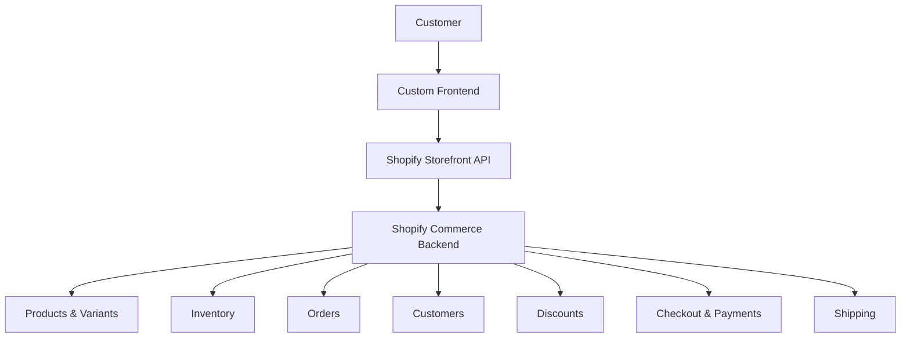

---

## 3. Technology Stack

### Frontend

- Next.js
- React
- JavaScript or TypeScript
- CSS / Tailwind CSS
- Responsive design
- Custom UI components

### Backend / Commerce

- Shopify
- Shopify Admin
- Shopify Storefront API
- Shopify Checkout

### Optional Services

- Cloudinary for product/media assets if required
- Analytics platform
- Email service
- Customer support/chat service

---

## 4. Responsibilities

### Custom Frontend

The frontend is responsible for:

- Homepage
- Navigation
- Product collections
- Product listing pages
- Product detail pages
- Product image galleries
- Size selection
- Colour selection
- Product filtering
- Product search
- Shopping cart interface
- Wishlist functionality, if implemented
- Customer-facing account pages
- Responsive mobile/desktop experience
- Animations and visual design
- Branding

### Shopify

Shopify is responsible for:

- Product management
- Product variants
- Prices
- Inventory
- Orders
- Customer records
- Discounts
- Checkout
- Payment processing
- Shipping configuration
- Tax configuration
- Store administration

---

## 5. System Architecture

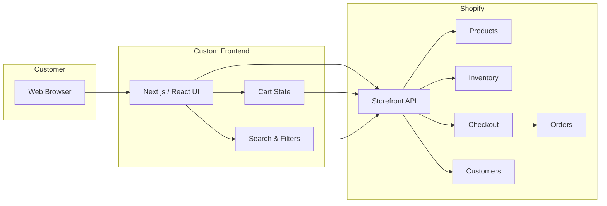

---

## 6. Product Flow

Products are created and managed inside Shopify.

The custom frontend does not need to maintain a separate product database.

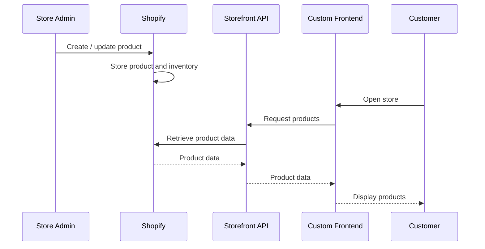

---

## 7. Product Data Example

A Shopify product may contain:

```text
Product
├── Title
├── Description
├── Images
├── Price
├── Compare-at price
├── Product type
├── Tags
├── Collections
└── Variants
    ├── Size
    ├── Colour
    ├── SKU
    ├── Price
    └── Inventory
```

Example:

```text
Oversized Black Hoodie

Price: R699

Colour:
- Black

Sizes:
- S
- M
- L
- XL

SKU:
HOODIE-BLK-S
HOODIE-BLK-M
HOODIE-BLK-L
HOODIE-BLK-XL
```

---

## 8. Product Page Flow

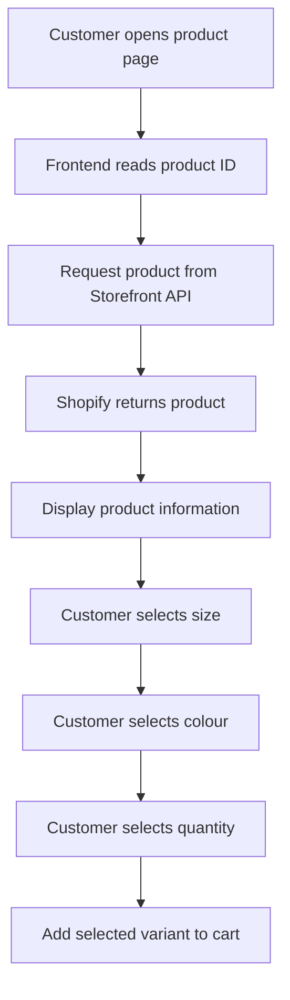

The frontend should use the **variant ID** when adding an item to the cart.

This is important because different sizes and colours can represent different Shopify variants and inventory quantities.

---

## 9. Shopping Cart Flow

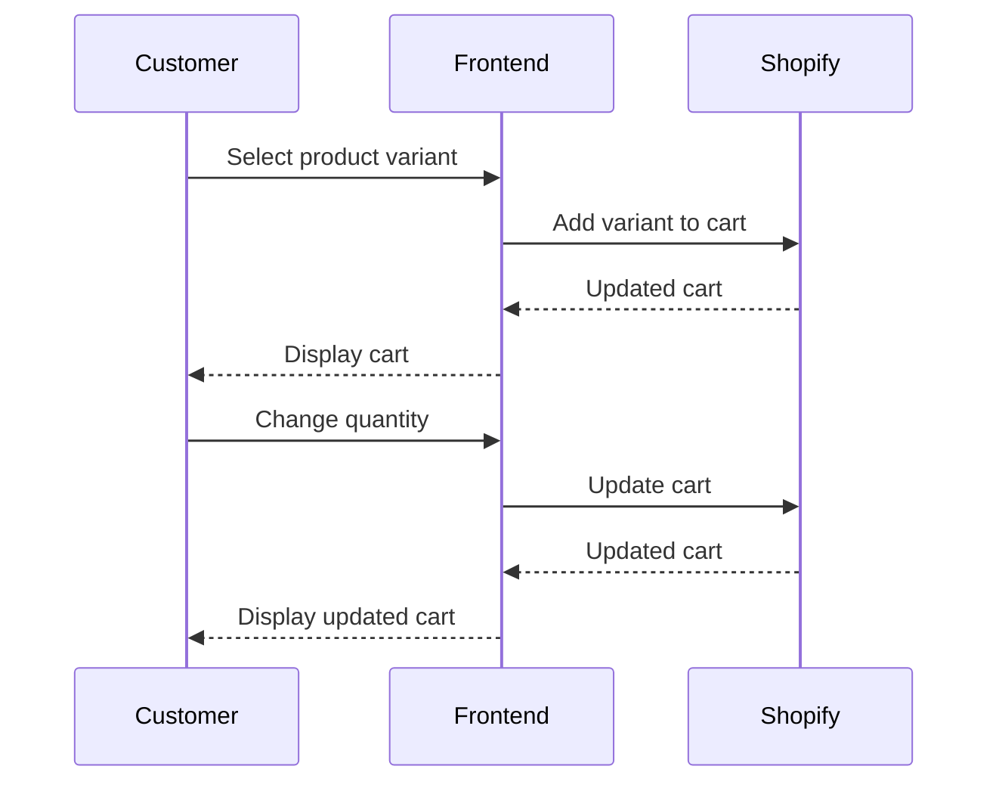

The cart should ultimately be backed by Shopify rather than creating an independent order system.

---

## 10. Checkout Flow

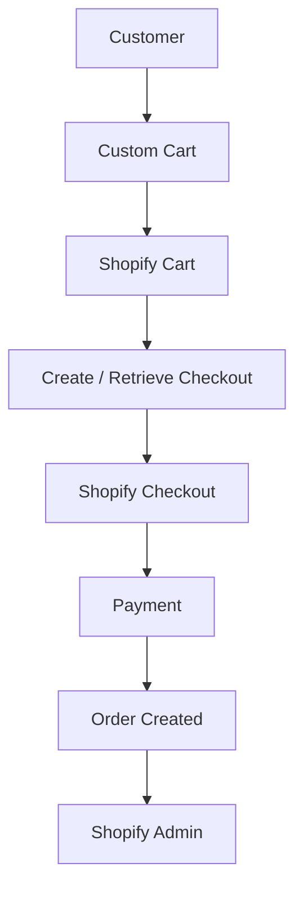

The custom frontend can control the shopping experience up to checkout.

Shopify then provides the checkout experience and processes the transaction according to the store's configured payment methods.

---

## 11. Order Flow

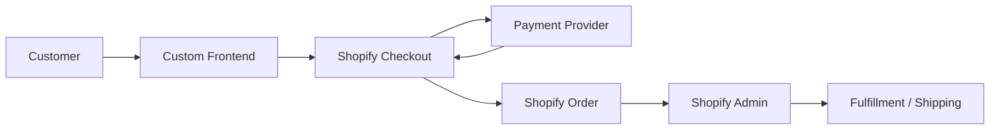

The Strapped store owner can manage orders from Shopify Admin instead of building an independent order-management dashboard.

---

## 12. Search and Filtering

The frontend can provide custom filtering such as:

- Category
- Collection
- Size
- Colour
- Price range
- Availability
- Product type
- Tags

Example:

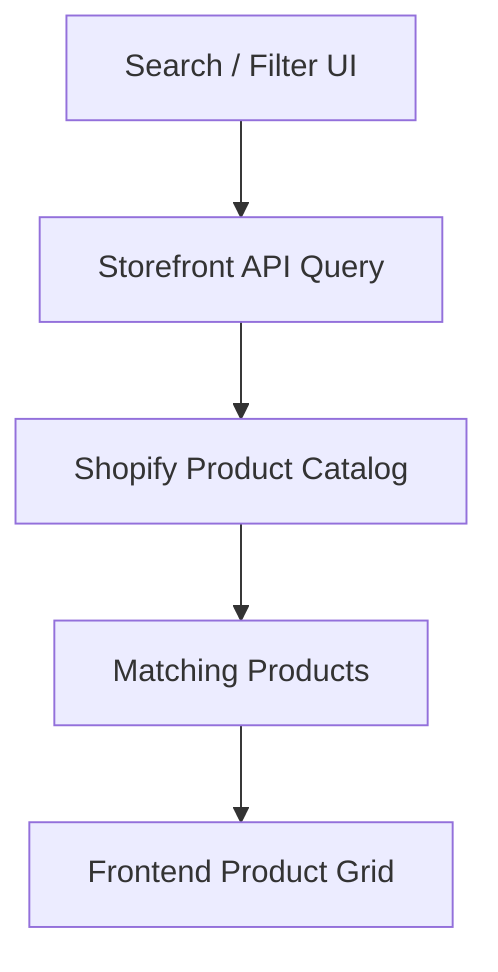

For more advanced search requirements, Shopify's supported search/query capabilities should be evaluated before introducing a separate search engine.

---

## 13. Recommended Frontend Structure

```text
clothing-store/
│
├── app/
│   ├── page
│   ├── products/
│   ├── collections/
│   ├── cart/
│   ├── search/
│   ├── account/
│   └── checkout/
│
├── components/
│   ├── Navbar
│   ├── Footer
│   ├── ProductCard
│   ├── ProductGrid
│   ├── ProductGallery
│   ├── ProductOptions
│   ├── CartDrawer
│   ├── SearchBar
│   └── FilterPanel
│
├── lib/
│   └── shopify/
│       ├── client
│       ├── queries
│       ├── mutations
│       └── types
│
├── styles/
│
├── public/
│
└── .env.local
```

---

## 14. Shopify API Layer

Keep Shopify API communication separate from UI components.

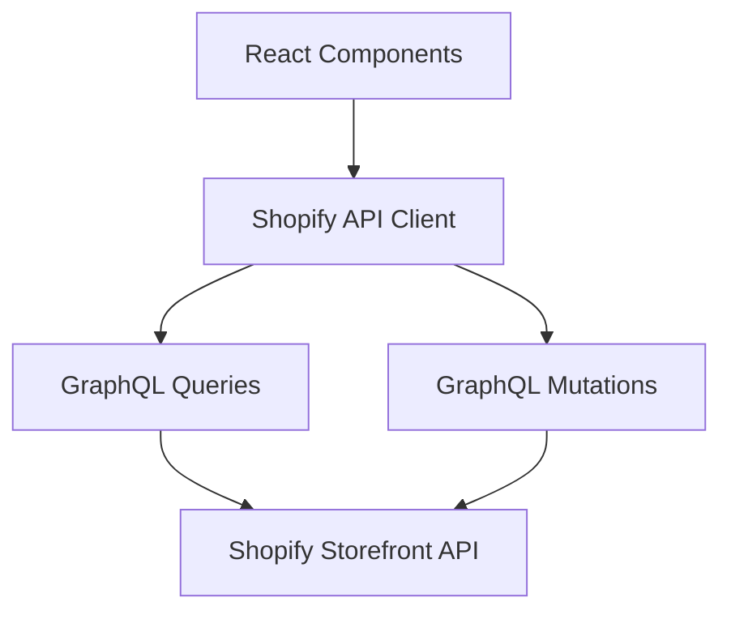

This makes the application easier to maintain and prevents Shopify-specific API logic from being scattered throughout the frontend.

---

## 15. Environment Variables

Sensitive configuration should not be hardcoded into the source code.

Example:

```env
SHOPIFY_STORE_DOMAIN=your-store.myshopify.com
SHOPIFY_STOREFRONT_ACCESS_TOKEN=your_token
```

Environment variables should be handled according to the framework's rules.

Any credential that grants privileged Shopify Admin access must **never be exposed to the browser**.

---

## 16. Security Model

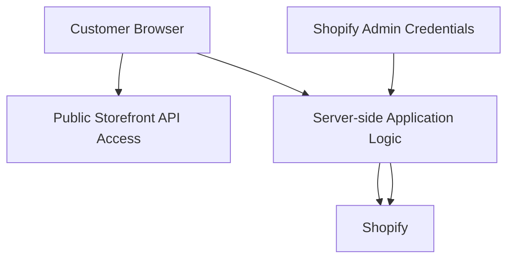

### Important rules

- Never expose Shopify Admin API credentials in frontend JavaScript.
- Do not commit secrets to Git.
- Use environment variables for credentials.
- Use HTTPS in production.
- Validate user-controlled input.
- Do not trust prices or product information sent by the client.
- Let Shopify remain the source of truth for products, inventory, carts, and orders.

---

## 17. Source of Truth

A major design principle is to avoid duplicating Shopify data unnecessarily.

| Data | Source of Truth |
|---|---|
| Product name | Shopify |
| Product description | Shopify |
| Product images | Shopify / configured media service |
| Price | Shopify |
| Size variants | Shopify |
| Colour variants | Shopify |
| Inventory | Shopify |
| Cart | Shopify |
| Orders | Shopify |
| Customer data | Shopify |
| Discounts | Shopify |
| Shipping configuration | Shopify |
| Frontend design | Custom application |

---

## 18. Customer Journey


---

## 19. Admin Workflow

The Strapped store owner does not need to edit the website whenever a product changes.

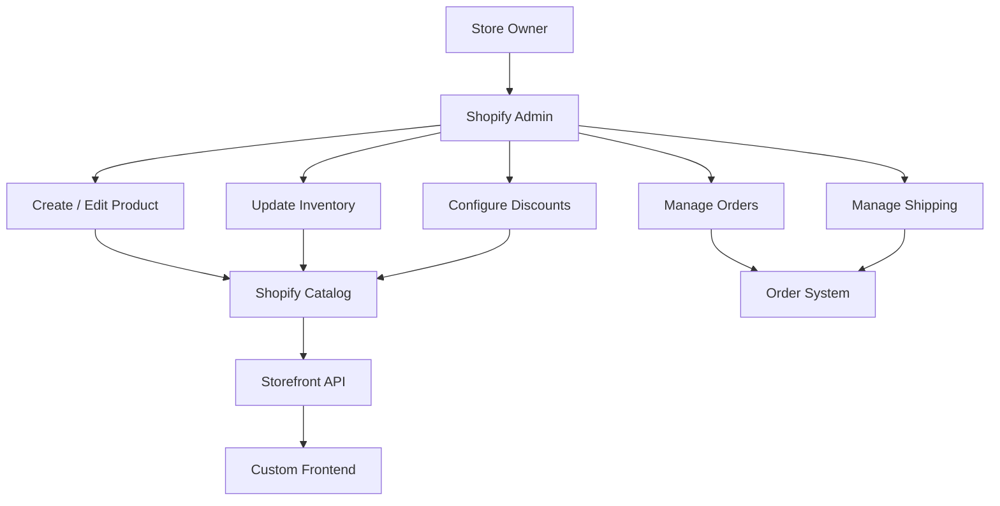

---

## 20. Why Use Headless Shopify?

### Advantages

- Complete control over frontend design
- Shopify handles complex commerce functionality
- No need to build an order system from scratch
- Shopify handles inventory management
- Shopify handles checkout and payment integrations
- Products can be managed without redeploying the frontend
- Easier to create a unique brand experience
- Can integrate custom frontend functionality

### Trade-offs

- More development work than a normal Shopify theme
- Requires knowledge of APIs
- Requires frontend application hosting
- More responsibility for frontend performance
- Some Shopify functionality may require additional implementation
- More moving parts to maintain

---

## 21. Recommended Development Strategy

### Phase 1 — Shopify Setup

1. Create Shopify store.
2. Configure store settings.
3. Add clothing products.
4. Create product variants.
5. Configure inventory.
6. Configure shipping.
7. Configure payment provider.
8. Create collections.
9. Configure basic store policies.

### Phase 2 — Frontend

1. Create Next.js application.
2. Build global layout.
3. Build navigation.
4. Build homepage.
5. Connect Shopify Storefront API.
6. Build collection pages.
7. Build product pages.
8. Implement variant selection.
9. Implement cart.
10. Connect Shopify checkout.

### Phase 3 — Store Features

1. Search.
2. Filtering.
3. Sorting.
4. Wishlist.
5. Customer accounts.
6. Order history.
7. Promotional banners.
8. Discount handling.
9. Product recommendations.

### Phase 4 — Production

1. Configure production environment variables.
2. Deploy frontend.
3. Configure custom domain.
4. Configure Shopify domain/checkout settings.
5. Test mobile responsiveness.
6. Test checkout.
7. Test inventory changes.
8. Test order creation.
9. Test failed payments.
10. Monitor errors and performance.

---

## 22. Final Architecture

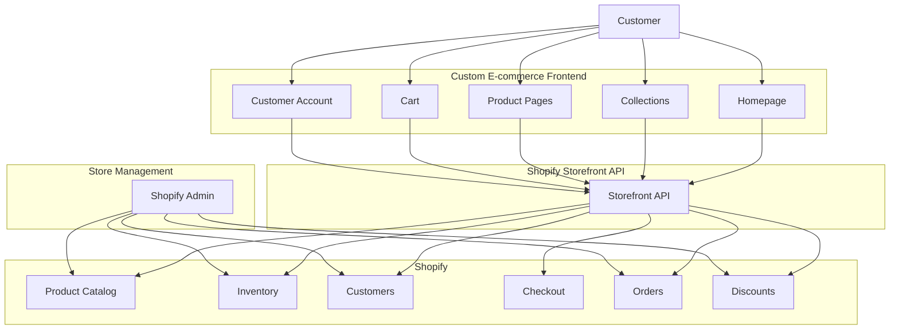

## 23. Core Principle

The project should follow this separation:

> **We own the experience. Shopify owns the commerce.**

The frontend controls how customers discover and interact with the clothing brand.

Shopify remains responsible for the underlying commerce infrastructure, including products, inventory, carts, checkout, payments, customers, and orders.
